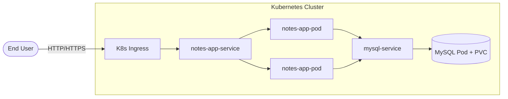
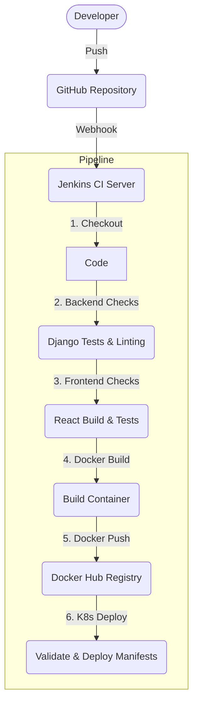

# 🚀 Django-React Notes App | DevSecOps Edition


Welcome to the **DevSecOps Edition** of the Django-React Notes App! This repository demonstrates a complete, production-ready DevOps lifecycle for a modern multi-tier web application. It transforms a standard full-stack app into a highly available, secure, and fully automated containerized deployment.

---

## 🌟 Key DevOps & Architecture Highlights

This project showcases industry-standard infrastructure practices expected of a modern DevOps Engineer:

- 🐳 **Containerization**: Optimized Docker builds using `python:3.12-slim`, with WhiteNoise serving static React builds.
- ☸️ **Orchestration**: Full Kubernetes deployment utilizing **Kustomize** for configuration management.
- 🔒 **DevSecOps**: Non-root containers (UID `10001`), secure `Secret` injection, and isolated volume permissions.
- 🔄 **CI/CD Automation**: A robust `Jenkinsfile` executing linting, unit testing, Node/Python environment building, and K8s manifest validation.
- 🩺 **Resiliency**: Built-in Liveness and Readiness probes to prevent `CrashLoopBackOff` and ensure zero-downtime rollouts.
- 💾 **Persistence**: Kubernetes `PersistentVolumeClaims` mapped to MySQL for stateful data retention.

---

## 🏗️ System Architecture

### 1. High-Level Flow



### 2. CI/CD Pipeline Lifecycle (Jenkins)



---

## 📂 Repository Structure

| Directory/File | Purpose |
| -------------- | ------- |
| 📁 `api/` & `notesapp/` | Django REST API source code and backend routing. |
| 📁 `mynotes/` | React frontend source and optimized production build output. |
| 📁 `k8s/` | Kubernetes YAML manifests (Deployments, Services, ConfigMaps, Secrets, Ingress). |
| 📄 `Dockerfile` | Unified runtime image (combines Django API and React static assets). |
| 📄 `.dockerignore` | Crucial ignores (avoids overriding `.map` files) to ensure clean `collectstatic` runs. |
| 📄 `Jenkinsfile` | Declarative CI/CD pipeline executing inside an isolated Jenkins Docker agent. |
| 📄 `docker-compose.yml` | Developer-friendly local stack for testing before K8s deployment. |

---

## 🚀 Getting Started

### 1. Local Development (Docker Compose)
To boot the entire stack locally without Kubernetes:
```bash
cp .env.example .env
docker compose up --build -d
```
Access the application via `http://localhost`.

### 2. Kubernetes Deployment (Kustomize)
To deploy the application into a Kubernetes cluster (e.g., Minikube or Kind):
```bash
# 1. Ensure you have your secrets configured (or edit k8s/secret.yml)
# 2. Apply all configurations via Kustomize
kubectl apply -k k8s/

# 3. Verify Pods and Services
kubectl get pods -n notes-app
kubectl get svc -n notes-app
```

### 3. CI/CD (Jenkins)
The pipeline requires a Jenkins agent configured with:
- `python3`, `python3-pip`, `python3-venv`
- `nodejs` (v18+)
- Docker CLI & Kubernetes CLI (`kubectl`)

The pipeline runs the following core validations:
```bash
# Backend
DJANGO_USE_SQLITE=true python3 manage.py check
DJANGO_USE_SQLITE=true python3 manage.py test api

# Frontend
cd mynotes && npm ci && npm run build
```

---

## 🛠️ Deep Dive: The "DevOpsification" Process
This project wasn't just built; it was **hardened**:
1. **The `collectstatic` Fix**: We resolved WhiteNoise `MissingFileError` crashes by carefully curating the `.dockerignore` to allow React sourcemaps.
2. **Security Contexts**: The `k8s/deployment.yml` forces containers to run as `runAsUser: 10001`, matching the `appuser` generated in the Dockerfile.
3. **Database Health**: `mysqladmin ping` probes were injected with `MYSQL_PWD` from K8s secrets so probes successfully authenticate without throwing connection errors.
4. **Allowed Hosts**: Configured `DJANGO_ALLOWED_HOSTS: "*"` via K8s ConfigMap so the Kubelet can successfully hit the `/api/healthz/` and `/api/readyz/` endpoints using Pod IP addresses.

---
*Built with ❤️ by an aspiring DevOps Engineer.*
