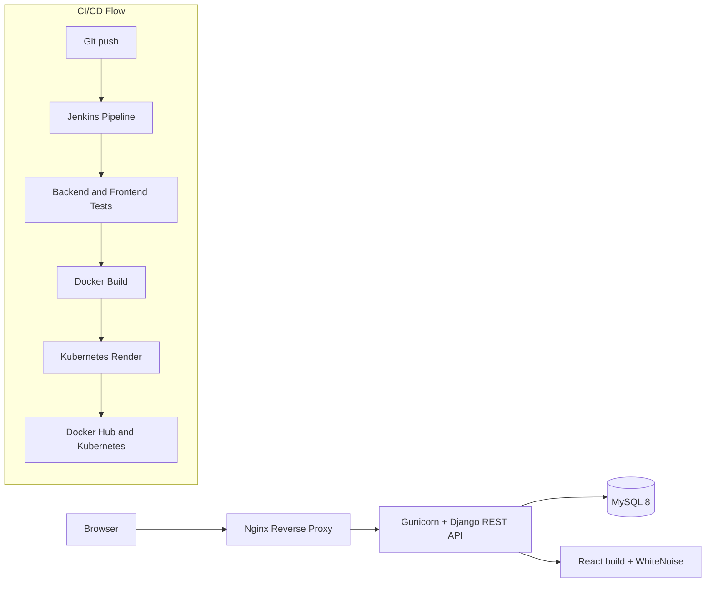
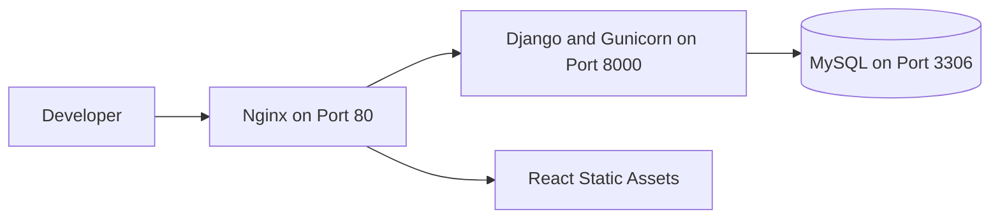
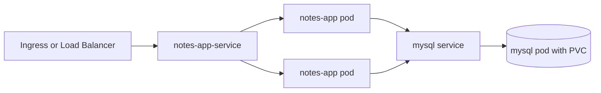

# Django Notes App K8s

This repository contains a full-stack notes application packaged as a DevOps portfolio project. The codebase demonstrates the path from application source to container image, local orchestration, Kubernetes deployment, and automated validation.

## Project Overview

The implementation covers the core delivery layers expected in a practical DevOps workflow:

- application code
- containerization
- local orchestration
- Kubernetes deployment
- continuous integration
- release validation
- basic hardening and health checks

The scope is intentionally compact, which keeps the project realistic for a fresher while still showing production-minded engineering choices.

## System Architecture



### Local Compose Topology



### Kubernetes Topology



## Repository Structure

| Path | Purpose |
| --- | --- |
| `api/` | Django REST API for note management |
| `notesapp/` | Django project settings and URL routing |
| `mynotes/` | React frontend source and build output |
| `k8s/` | Kubernetes manifests and kustomize entrypoint |
| `Dockerfile` | Runtime image for Django and Gunicorn |
| `docker-compose.yml` | Local multi-container stack |
| `Jenkinsfile` | CI/CD pipeline definition |
| `.github/workflows/ci.yml` | GitHub Actions workflow |
| `Makefile` | Local shortcuts for validation and rendering |

## Application Layer

### Django Backend

The backend exposes:

- CRUD endpoints for notes
- `/api/healthz/` for liveness checks
- `/api/readyz/` for readiness checks
- a route discovery endpoint under `/api/`

The backend is configured entirely through environment variables:

- `DJANGO_SECRET_KEY`
- `DJANGO_DEBUG`
- `DJANGO_ALLOWED_HOSTS`
- `DJANGO_DB_ENGINE`
- `MYSQL_DATABASE`
- `MYSQL_USER`
- `MYSQL_PASSWORD`
- `MYSQL_ROOT_PASSWORD`
- `MYSQL_HOST`
- `MYSQL_PORT`
- `CORS_ALLOWED_ORIGINS`
- `CSRF_TRUSTED_ORIGINS`

### React Frontend

The frontend is a lightweight React application compiled into `mynotes/build` and served by the Django runtime. The focus is not on a complex UI system. The focus is on a clean delivery pipeline and a maintainable deployment flow.

### Data Storage

MySQL is used as the persistent datastore. In Kubernetes the database is paired with a PersistentVolumeClaim so state survives pod recreation. In local Compose, the database is backed by a named Docker volume.

## Container Layer

The runtime image is designed to be repeatable and conservative:

- base image: `python:3.12-slim`
- non-root application user
- Gunicorn as the production process
- MySQL client libraries installed for the backend database driver
- `.dockerignore` to keep the build context small

The image reference used by the deployment is:

```text
sudarshan0907/notes-app-k8s:latest
```

## Kubernetes Layer

The Kubernetes manifests implement the following:

- namespace isolation
- ConfigMap for non-secret runtime configuration
- Secret for database credentials
- app Deployment
- MySQL Deployment
- ClusterIP Services for internal traffic
- PersistentVolumeClaim for MySQL storage
- liveness and readiness probes
- init migration step for the app pod
- resource requests and limits
- kustomize as the deployment entrypoint

## CI/CD Layer

The pipeline is intentionally straightforward and explainable in an interview.

### Jenkins Pipeline

| Stage | Purpose |
| --- | --- |
| Checkout | Pulls the exact source revision |
| Backend checks | Runs Django checks and API tests |
| Frontend checks | Runs React tests and production build |
| Docker build | Produces the runtime container image |
| Push image | Publishes the image to Docker Hub on `main` |
| Kubernetes render | Validates the Kubernetes manifests with kustomize |

### GitHub Actions

The GitHub Actions workflow mirrors the same validation path:

- backend validation
- frontend validation
- Docker build
- Kubernetes render

This gives the project two pipeline surfaces:

- Jenkins for classic CI/CD delivery
- GitHub Actions for repository-native continuous integration

## Local Development

Create a local environment file:

```bash
cp .env.example .env
```

Start the stack:

```bash
docker compose up --build
```

The application is exposed through Nginx at:

```text
http://localhost
```

## Validation Commands

### Backend

```bash
DJANGO_USE_SQLITE=true python3 manage.py check
DJANGO_USE_SQLITE=true python3 manage.py test api
```

### Frontend

```bash
cd mynotes
npm ci
npm run test:ci
npm run build
```

### Docker

```bash
docker build -t sudarshan0907/notes-app-k8s:latest .
```

### Kubernetes

```bash
kubectl kustomize k8s
kubectl apply -k k8s
```

### Compose

```bash
docker compose up --build
docker compose ps
docker compose logs web
docker compose down
```

## Security and Hardening

The project includes practical hardening choices that are appropriate for a portfolio-grade DevOps system:

- non-root container execution
- health and readiness endpoints
- separation of config and secrets
- resource limits on app and database pods
- safe defaults for debug and host settings
- automatic migration handling during startup
- `.dockerignore` for smaller build contexts

## Current Scope

The project is intentionally not enterprise-complete. The remaining gaps are clear and easy to explain:

- no external secret manager
- no image scanning gate
- no dependency scanning gate
- no observability stack
- no HPA or network policies
- no application-level authentication

That scope is appropriate for a fresher project because it keeps the focus on delivery fundamentals, not on unnecessary platform complexity.

## Project Attribution

Maintainer: `sudarshanvashisht`
