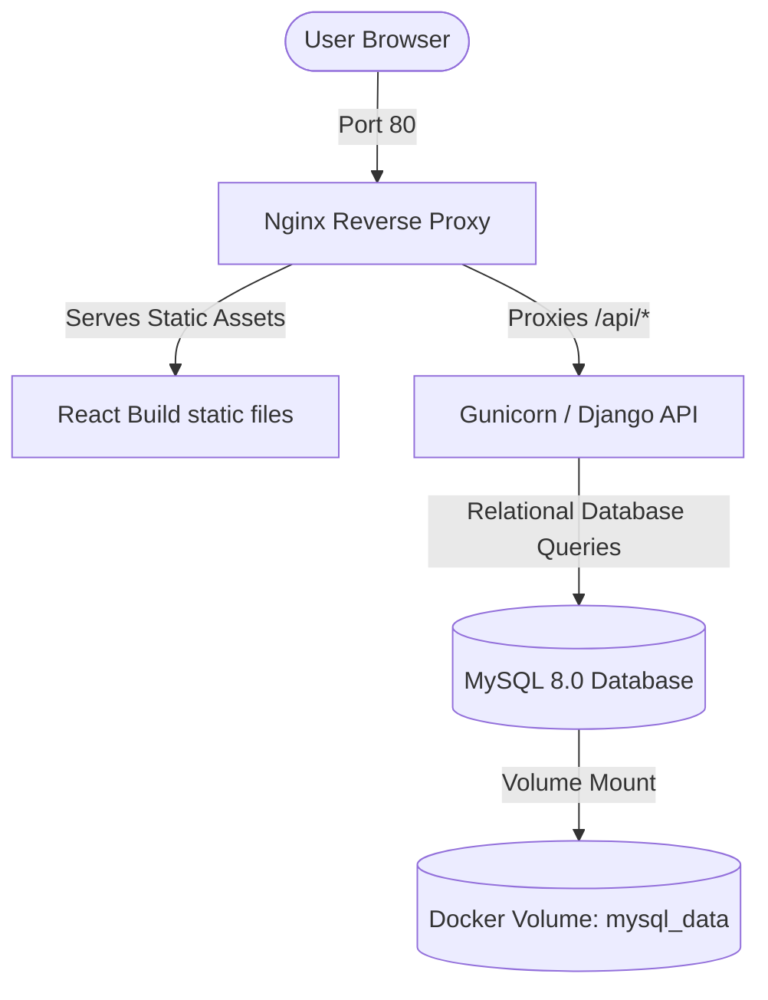
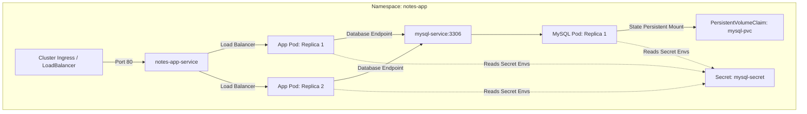
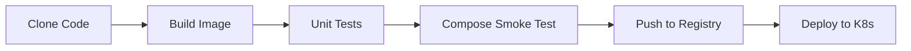

# 🚀 Production-Grade Django & React Notes App: DevOps & GitOps Lifecycle

This repository contains a full-stack Notes Application designed, containerized, and configured for a complete **DevOps & GitOps lifecycle**. The project showcases secure containerization, automated testing, transient smoke tests, local cluster orchestration with **Kubernetes (Kind)**, and an automated continuous integration and continuous deployment (CI/CD) engine powered by **Jenkins**.

---

## 📐 System & Deployment Architecture

This project implements a classic 3-tier architecture decoupled for high availability, security, and independent scaling.

### 1. Local Development Stack (Docker Compose)
In the development environment, Nginx acts as a reverse proxy serving the React frontend static build and routing API calls to Gunicorn/Django, which connects to a dedicated MySQL instance.



### 2. Kubernetes Orchestration Architecture (Production Target)
In the production cluster, traffic enters via an Nginx Ingress Controller, which performs Layer 7 load balancing to route external HTTP requests to the Django Web Service. Django runs in a multi-replica configuration, connecting to a persistent MySQL database secured via Kubernetes Secrets.



---

## 🛠️ Infrastructure & Tech Stack
*   **Application Core:** Django REST Framework (Backend API) & React (Frontend SPA).
*   **Server Engine:** Gunicorn WSGI HTTP Server.
*   **Web Server & Reverse Proxy:** Nginx (Alpine-based, serves frontend builds and proxies API requests).
*   **Local Multi-Container Runtime:** Docker Compose.
*   **Container Orchestration:** Kubernetes (Kind Local Cluster).
*   **Continuous Integration Engine:** Jenkins (Declarative pipeline running in Docker).
*   **Container Registry:** Docker Hub (`sudarshan0907/notes-app-k8s`).

---

## 🔒 DevSecOps & Security Hardening

### 1. Non-Root Container Execution (CIS Benchmark)
To mitigate container escape vulnerabilities and privilege escalation attacks, the Gunicorn/Django container runs as a dedicated non-privileged system user (`appuser`, UID 10001) instead of root.

```dockerfile
# Security: Create non-root application user
RUN groupadd -g 10001 appuser \
    && useradd -u 10001 -g appuser -m -s /bin/bash appuser \
    && chown -R appuser:appuser /app

COPY --chown=appuser:appuser . .

USER appuser
```

### 2. Kubernetes Secret Management
Database credentials (`MYSQL_DATABASE`, `MYSQL_USER`, `MYSQL_PASSWORD`, `MYSQL_ROOT_PASSWORD`) are never hardcoded in source code or container layers. They are managed via Kubernetes Opaque Secrets (`mysql-secret.yml`) and dynamically injected into pods at runtime using `envFrom`.

### 3. Git Exclusions
The `.env` file containing local credentials is fully excluded from version control via `.gitignore`. A `.env.example` file is provided as a template for onboarding developers.

---

## 🤖 Jenkins CI/CD Pipeline (GitOps Lifecycle)

The Jenkins pipeline automates the software development lifecycle from code commit to target environment deployment.



### Pipeline Stage Details

| Stage | Operations Performed | DevOps Impact |
|---|---|---|
| **Clone Code** | Checks out the latest commit on the `main` branch. Retrieves Git Commit SHA as the build identifier. | Dynamic tagging traceability. |
| **Build Docker Image** | Builds the backend image locally using Docker layer caching optimization. | Fast rebuild times. |
| **Run Unit Tests** | Executes Django API tests inside a transient container run using SQLite in-memory DB. | Early test-driven quality assurance. |
| **Test & Run via Compose** | Starts Gunicorn + MySQL container stack using Docker Compose, performs health check, and checks container logs before tearing down the stack. | Transient integration/smoke testing. |
| **Push to Docker Hub** | Logins, tags, and pushes the built image with both the unique Git SHA tag (`:a9840f8`) and the `:latest` tag to Docker Hub. | Immutable release tracking. |
| **Deploy to Kubernetes** | Loads the image into Kind nodes, injects the Git tag into deployment manifests via `sed`, and applies resource manifests to rolling restart the workload. | Progressive GitOps deployment. |

---

## ☸️ Kubernetes Infrastructure Layout (`/k8s`)

The declarative manifests in `/k8s` define a self-healing, decoupled state in the cluster:

| Manifest | Kubernetes Resource | Description | Configuration Details |
|---|---|---|---|
| `namespace.yml` | `Namespace` | Logical segregation of assets. | Namespace: `notes-app` |
| `mysql-secret.yml` | `Secret` | Sensitive configuration data. | Opaque secret containing 4 DB credentials. |
| `mysql-pvc.yml` | `PersistentVolumeClaim` | Permanent database block storage request. | Size: `5Gi`, AccessMode: `ReadWriteOnce`. |
| `mysql-deployment.yml` | `Deployment` | Stateful single-replica MySQL 8.0 database. | Mounted to PVC, uses `Recreate` strategy, executes `mysqladmin ping` probes. |
| `mysql-service.yml` | `Service` | Exposes MySQL cluster-internally. | Type: `ClusterIP`, Port: `3306`. |
| `deployment.yml` | `Deployment` | Django application lifecycle controller. | 2 Replicas, defines CPU/Memory requests & limits, configures HTTP probes, allows wildcard host headers. |
| `service.yml` | `Service` | Exposes Django application internally. | Type: `ClusterIP`, Port: `8000`. |
| `ingress.yml` | `Ingress` | Decoupled entry gateway for routing external HTTP requests. | Routes `/` traffic on port 80 to `notes-app-service`. |

### Self-Healing & Reliability Configs

#### 1. Ingress Layer 7 Routing
External traffic is routed to the application through `ingress.yml` which points to `notes-app-service:8000`, eliminating the need to expose NodePorts on cluster nodes.

#### 2. Liveness & Readiness Probes
Both deployments utilize automated health monitoring to enable self-healing and zero-downtime rollouts:
*   **Application Pods:** Periodically query the HTTP `/api/` endpoint on port 8000.
*   **MySQL Pods:** Periodically execute `mysqladmin ping -h localhost` to confirm database readiness.

#### 3. MySQL PVC Deadlock Mitigation
The database deployment uses `strategy.type: Recreate` instead of `RollingUpdate`. Because the Persistent Volume utilizes `ReadWriteOnce` access mode, a rolling update would deadlock because the new replica cannot lock the volume while the old replica is still running and holding the lock. `Recreate` terminates the old pod first, releasing the lock, and then successfully spins up the new replica.

#### 4. Django Allowed Hosts Fix
To prevent HTTP 400 Bad Request errors during internal Kubernetes readiness and liveness checks (which hit the pod on its internal IP address), the environment variable `DJANGO_ALLOWED_HOSTS: "*"` is injected into the container's runtime environment.

---

## 🧪 Automated Testing

### Django REST API Unit Tests (`api/tests.py`)
A comprehensive unit test suite is included to validate the Django REST API CRUD endpoints. The suite covers:
*   `test_get_all_notes`: Asserts `GET /api/notes/` returns HTTP 200.
*   `test_get_single_note`: Asserts `GET /api/notes/<id>/` retrieves correct note body.
*   `test_create_note`: Asserts `POST /api/notes/create/` persists a new note record.
*   `test_update_note`: Asserts `PUT /api/notes/<id>/update/` successfully modifies note content.
*   `test_delete_note`: Asserts `DELETE /api/notes/<id>/delete/` removes the record.
*   `test_get_api_routes`: Asserts root API documentation endpoint works.

### Test Isolation (In-Memory Database)
To keep CI builds fast and independent of database infrastructure, `notesapp/settings.py` includes a fallback mechanism that automatically redirects the database engine to an **in-memory SQLite database** during testing.

```python
import sys

if 'test' in sys.argv:
    DATABASES = {
        'default': {
            'ENGINE': 'django.db.backends.sqlite3',
            'NAME': ':memory:',
        }
    }
```

---

## 🛠️ Operational Tasks (How to Run)

### 1. Local Development (Docker Compose)
To spin up Gunicorn, MySQL, and Nginx locally:
```bash
# Clone the repository
git clone https://github.com/sudarshanvashisht/django-notes-app-k8s.git
cd django-notes-app-k8s

# Create environment template
cp .env.example .env

# Run compose
docker compose up --build -d
```
Access the application on your host machine at `http://localhost`.

### 2. Run Local Unit Tests
To validate code quality before pushing commits:
```bash
# Build test image
docker build . -t notes-app-test:local

# Run tests
docker run --rm notes-app-test:local python manage.py test
```

### 3. Deploy Manually to Kubernetes Cluster
If you want to bypass Jenkins and apply configurations directly:
```bash
# Apply resources
kubectl apply -f k8s/namespace.yml
kubectl apply -f k8s/mysql-secret.yml
kubectl apply -f k8s/

# Monitor deployment progress
kubectl get pods -n notes-app -w
```