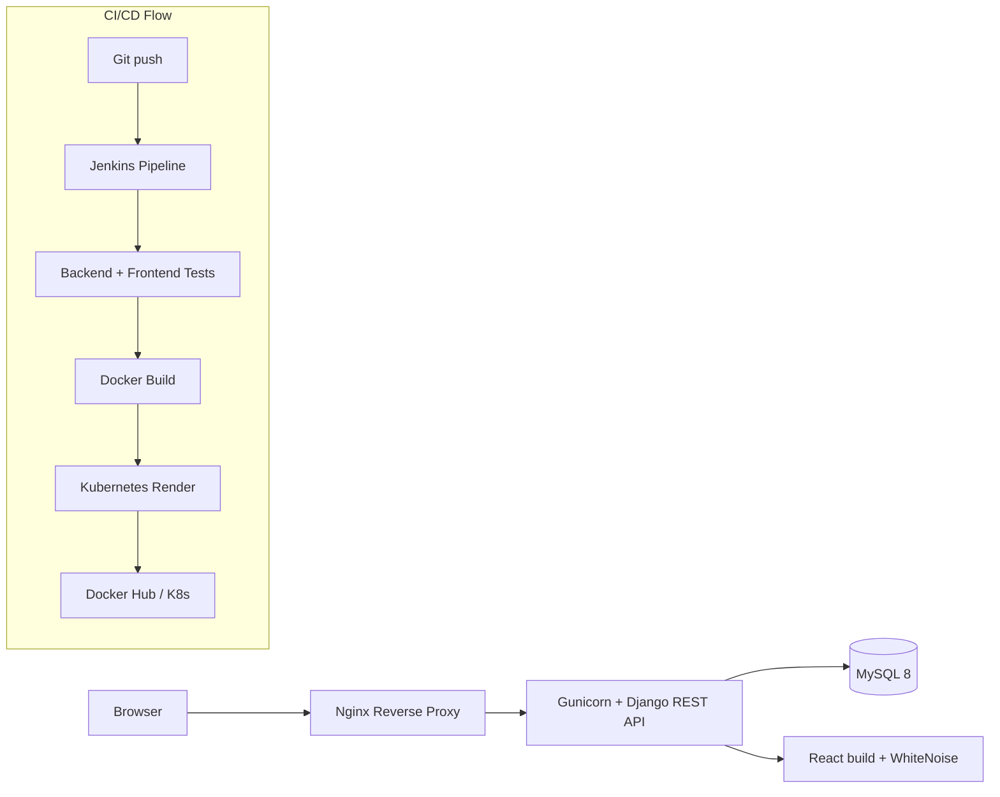
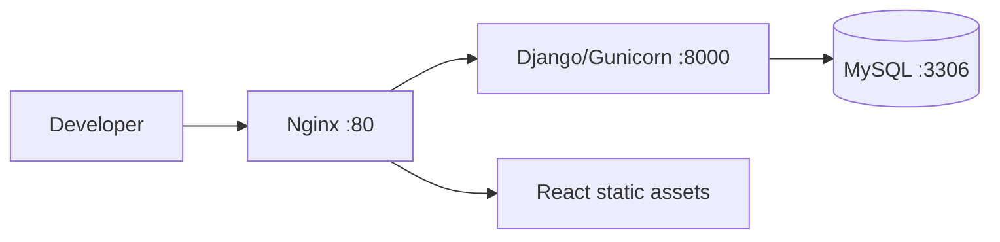
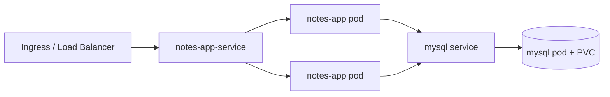

# Django Notes App K8s

This repository is a DevOps-focused full-stack project built to demonstrate the complete delivery path for a small production-style application:

- application code
- containerization
- local orchestration
- Kubernetes deployment
- CI/CD automation
- health checks and release hygiene
- test coverage across backend, frontend, image build, and manifests

The project is intentionally scoped to be realistic for a fresher portfolio while still showing the pieces a DevOps engineer is expected to understand and explain.

## What This Project Proves

- You can take a Django + React application and package it cleanly.
- You understand how to separate app config, secrets, and infrastructure config.
- You can define repeatable build and test steps.
- You can deploy through Docker Compose and Kubernetes.
- You can add health checks, resource limits, and migration handling.
- You can explain the path from local development to a CI/CD pipeline.

## High-Level Architecture



## Runtime Topology

### Local Compose



### Kubernetes



## Repository Layout

| Path | Purpose |
| --- | --- |
| `api/` | Django REST API for notes CRUD |
| `notesapp/` | Django project settings and URL routing |
| `mynotes/` | React frontend source and build output |
| `k8s/` | Kubernetes manifests and kustomize entrypoint |
| `Dockerfile` | Runtime image for Django + Gunicorn |
| `docker-compose.yml` | Local multi-container stack |
| `Jenkinsfile` | CI/CD pipeline definition |
| `.github/workflows/ci.yml` | GitHub Actions CI workflow |
| `Makefile` | Local shortcuts for checks and rendering |

## Architecture Breakdown

### Django backend

The backend provides:

- CRUD endpoints for notes
- `/api/healthz/` for liveness checks
- `/api/readyz/` for readiness checks
- a public routes endpoint for quick discovery

The backend is configured with environment-driven settings:

- `DJANGO_SECRET_KEY`
- `DJANGO_DEBUG`
- `DJANGO_ALLOWED_HOSTS`
- `DJANGO_DB_ENGINE`
- `MYSQL_DATABASE`
- `MYSQL_USER`
- `MYSQL_PASSWORD`
- `MYSQL_ROOT_PASSWORD`
- `MYSQL_HOST`
- `MYSQL_PORT`
- `CORS_ALLOWED_ORIGINS`
- `CSRF_TRUSTED_ORIGINS`

### React frontend

The frontend is a simple notes UI built with React Router and bundled into `mynotes/build`.

Key points:

- the UI is served as part of the Django runtime via WhiteNoise and template integration
- the app is kept intentionally lightweight so the focus stays on delivery and operations
- tests cover the shell rendering path

### Docker

The Docker image is designed for repeatable deployment:

- base image: `python:3.12-slim`
- installs only the runtime and build dependencies needed for MySQL support
- runs as a non-root user
- executes Gunicorn as the production process
- uses `.dockerignore` to keep the build context small

### Kubernetes

The Kubernetes layer includes:

- Namespace isolation
- ConfigMap for non-secret app config
- Secret for database credentials
- Deployment for the app
- Deployment for MySQL
- Services for app and database
- PVC for database persistence
- liveness and readiness probes
- init migration step for the app
- resource requests and limits
- kustomize entrypoint for consistent application

The default image reference is:

```text
sudarshan0907/notes-app-k8s:latest
```

## CI/CD Design

The pipeline is intentionally simple enough to explain in an interview but complete enough to show real DevOps thinking.

### Jenkins pipeline stages

| Stage | What it does | Why it matters |
| --- | --- | --- |
| Checkout | Pulls the repository | Ensures the pipeline runs against the exact source revision |
| Backend checks | Runs Django check and tests | Catches application and configuration errors early |
| Frontend checks | Runs React tests and build | Verifies the UI is buildable and render-safe |
| Docker build | Builds the runtime image | Proves the app is container-ready |
| Push image | Pushes to Docker Hub on `main` | Publishes a release artifact |
| Kubernetes render | Renders manifests with kustomize | Validates deployment YAML before applying it |

### GitHub Actions

The GitHub Actions workflow mirrors the same quality gates:

- backend validation
- frontend validation
- Docker build
- Kubernetes render

That gives you two pipeline surfaces to talk about:

- Jenkins for the classic DevOps/CD story
- GitHub Actions for repo-native continuous integration

## Local Development

Create a local environment file:

```bash
cp .env.example .env
```

Start the full stack:

```bash
docker compose up --build
```

The app is exposed through the Nginx container on:

```text
http://localhost
```

## Validation Commands

### Backend

```bash
DJANGO_USE_SQLITE=true python3 manage.py check
DJANGO_USE_SQLITE=true python3 manage.py test api
```

### Frontend

```bash
cd mynotes
npm ci
npm run test:ci
npm run build
```

### Docker

```bash
docker build -t sudarshan0907/notes-app-k8s:latest .
```

### Kubernetes

```bash
kubectl kustomize k8s
kubectl apply -k k8s
```

### Compose

```bash
docker compose up --build
docker compose ps
docker compose logs web
docker compose down
```

## Security and Hardening

This project is not pretending to be an enterprise platform, but it does include several practical hardening steps:

- non-root container user
- health and readiness endpoints
- ConfigMap and Secret separation
- resource limits on app and database pods
- safe defaults for debug and host configuration
- database migration as an init step rather than a manual afterthought
- `.dockerignore` to reduce accidental context leakage

## What Still Keeps It From Being “Enterprise”

This is worth knowing before an interview:

- no real secret manager
- no image scanning
- no dependency scanning gate
- no alerting/observability stack
- no HPA or network policies
- no auth layer for the application itself

That is fine for a fresher project. It is better to explain the gaps honestly than to pretend they do not exist.

## Suggested Interview Explanation

If someone asks what this project demonstrates, the clean answer is:

> I took a Django + React app and turned it into a repeatable DevOps delivery pipeline with containerization, CI, Kubernetes deployment, health checks, and safe configuration separation.

If they ask what you learned, focus on:

- build reproducibility
- container image hygiene
- Kubernetes deployment mechanics
- app health and readiness strategy
- pipeline stage ordering
- how a local app becomes a deployable artifact

## Notes

- `k8s/mysql-secret.yml` contains placeholder values. Replace them before any real deployment.
- The app is intentionally open and simple for demo use.
- The Docker Hub image reference is part of the project story, so keep that repository name consistent if you retag releases.
