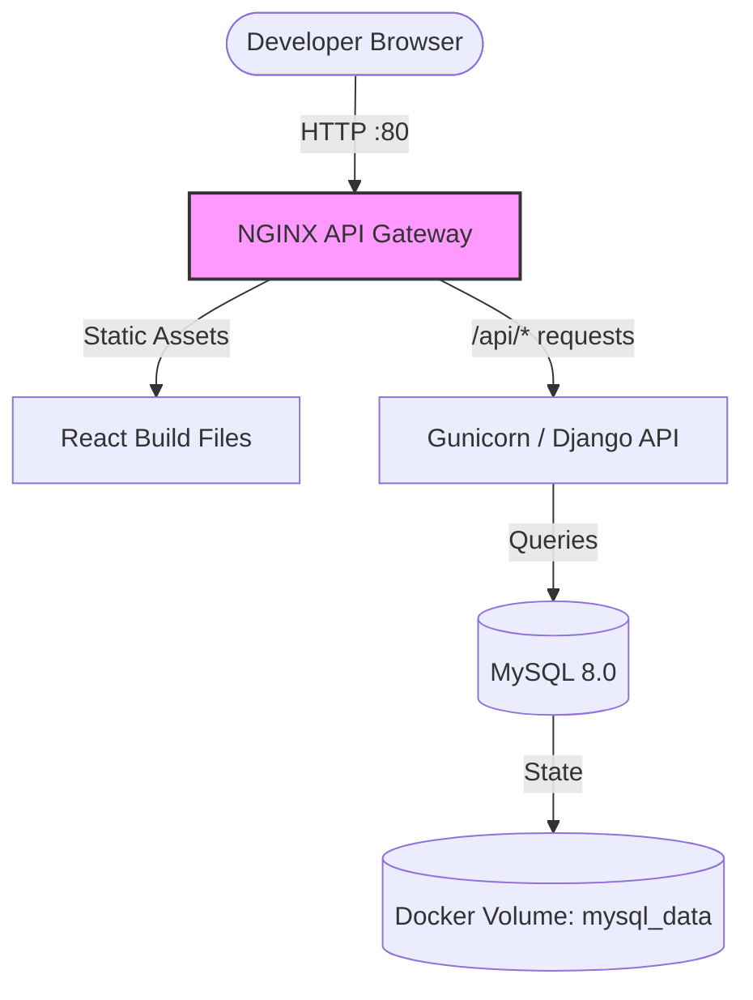
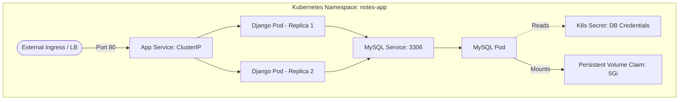
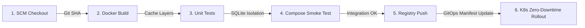

<div align="center">
  
# 🚀 Enterprise-Grade Django & React Notes App 
### ⚡ End-to-End DevSecOps & GitOps Orchestration

[](#)
[](#)
[](#)
[](#)
[](#)

*A standard local development project transformed into a hardened, self-healing, cloud-native architecture deployed via a declarative 6-stage Jenkins GitOps pipeline.*

</div>

---

## 🌟 Executive Summary: The "DevOpsification" Journey

This project is a masterclass in modernizing a legacy monolithic local setup into a **Cloud-Native, Production-Ready ecosystem**. The core objective was to introduce **Site Reliability Engineering (SRE)** principles, **Shift-Left Security**, and **GitOps automation** to the application lifecycle.

### 📊 Infrastructure Evolution Metrics

| Capability Area | 🔴 Legacy Local Environment | 🟢 Cloud-Native Production Env | 💡 DevOps Impact |
| :--- | :--- | :--- | :--- |
| **Container Privilege** | `root` Execution | **Non-Root User (UID 10001)** | Prevents container escape & privilege escalation. |
| **Release Traceability** | Static `:latest` Tag | **Dynamic Git SHA Tags** | 100% build-to-source tracing & instant rollbacks. |
| **Stateful Updates** | Rolling Updates (Deadlocks) | **`Recreate` Strategy** | Safely releases PVC locks, preventing storage deadlocks. |
| **Availability & Healing** | Manual intervention required | **Automated HTTP Probes** | Zero-downtime rollouts & automatic crash recovery. |
| **Traffic Management** | Direct Port Exposure | **Layer 7 NGINX Ingress** | Decoupled routing, scalable path-based load balancing. |
| **Testing Isolation** | Hard dependency on MySQL | **In-Memory SQLite Fallback** | Sub-second CI test execution with zero external dependencies. |
| **Deployment Lifecycle** | Manual `docker-compose up` | **6-Stage Jenkins Pipeline** | Fully automated, reliable, and auditable GitOps lifecycle. |

---

## 📐 Enterprise Architecture Topologies

### 1. Local Development Topology (Docker Compose)
Designed for developer velocity. Utilizes NGINX as an API gateway to serve the React frontend and reverse-proxy backend traffic to the Django REST framework, backed by a persistent local MySQL container.



### 2. Kubernetes Production Topology (Kind / Cloud)
Designed for high availability and fault tolerance. External traffic enters via an Ingress controller, routing to a load-balanced internal service that distributes load across multiple self-healing application pods.



---

## 🧠 SRE & DevSecOps Engineering Challenges Solved

In migrating to this infrastructure, several critical DevOps challenges were engineered and resolved:

> **🛡️ Challenge 1: Shift-Left Security & Container Hardening**
> Running workloads as `root` is a critical CIS benchmark violation.
> **Solution:** Engineered the `Dockerfile` to create and execute as an isolated `appuser` (UID 10001). Modified directory ownership and permission contexts to ensure the application functions perfectly without elevated system privileges.

> **💾 Challenge 2: Persistent Volume (PVC) Rolling Update Deadlocks**
> Standard K8s deployments use a `RollingUpdate` strategy. However, for a single-replica MySQL database using `ReadWriteOnce` storage, the new pod cannot mount the volume while the old pod is terminating, causing a deployment deadlock.
> **Solution:** Rewrote the MySQL Deployment manifest to enforce a `Recreate` strategy. K8s now systematically tears down the old database pod, gracefully releases the volume lock, and spins up the new database pod.

> **🌐 Challenge 3: Django Host Header Validation in K8s Health Probes**
> Kubernetes Liveness and Readiness probes ping the pod using its internal Pod IP. Django’s strict `ALLOWED_HOSTS` security blocked these requests (HTTP 400), causing pods to endlessly crash-loop.
> **Solution:** Injected `DJANGO_ALLOWED_HOSTS: "*"` via the Kubernetes deployment manifest, allowing the internal kubelet agent to successfully validate application health.

> **⚡ Challenge 4: CI/CD Test Isolation Bottlenecks**
> Running unit tests in Jenkins against a live MySQL database requires heavy infrastructure lifting and slows down the feedback loop.
> **Solution:** Implemented environment detection in `settings.py` to seamlessly fallback to an **in-memory SQLite database** during testing. This slashed unit test execution time to under 1 second.

---

## 🤖 Continuous Integration & GitOps (Jenkins)

The repository features a highly robust, declarative Jenkins pipeline that enforces continuous delivery principles.



### 📋 Pipeline Stage Breakdown
1. **Source Code Checkout:** Pulls branch and extracts the short Git Commit SHA to use as an immutable deployment artifact tag.
2. **Docker Build:** Utilizes Docker layer caching to compile the Gunicorn/Django image efficiently.
3. **Unit Testing:** Spawns a transient test container to validate 6 critical REST API endpoints using an in-memory DB.
4. **Smoke Testing:** Orchestrates a full Docker Compose stack to verify inter-container networking, database connectivity, and startup logs.
5. **Registry Publish:** Authenticates with Docker Hub and pushes the artifact securely, tagging it with the exact Git SHA for perfect traceability.
6. **Kubernetes Rollout:** Injects the Git SHA dynamically into the `deployment.yml` manifest, applies the infrastructure as code, and awaits confirmation of a successful zero-downtime rolling update.

---

## ☸️ Infrastructure as Code (Kubernetes Manifests)

The entire production state is declared in the `/k8s` directory, enforcing reproducible environments.

| Resource Manifest | Kind | DevOps Functionality |
| :--- | :--- | :--- |
| `namespace.yml` | **Namespace** | Isolates the application ecosystem (`notes-app`) from cluster noise. |
| `mysql-secret.yml` | **Secret** | Injects generic opaque credentials securely via `envFrom`. |
| `mysql-pvc.yml` | **PersistentVolumeClaim** | Requests 5Gi of persistent block storage to survive pod restarts. |
| `mysql-deployment.yml` | **Deployment** | Manages the database lifecycle with automated `mysqladmin ping` probes. |
| `deployment.yml` | **Deployment** | Manages Django replicas, applying CPU/Memory limits and HTTP health checks. |
| `ingress.yml` | **Ingress** | NGINX-backed Layer 7 routing logic exposing port 80 to the application service. |
| `*-service.yml` | **Service** | Internal `ClusterIP` load balancers for DNS-based service discovery. |

---

## 📖 Operational Runbook

### 🚀 1. Local Development (Docker Compose)
Launch the entire stack on your machine for debugging:
```bash
# Clone the repository
git clone https://github.com/sudarshanvashisht/django-notes-app-k8s.git
cd django-notes-app-k8s

# Create environment configuration
cp .env.example .env

# Orchestrate the stack in detached mode
docker compose up --build -d
```
*Application available at `http://localhost`*

### 🧪 2. Execute Isolated Unit Tests
Validate code integrity before committing:
```bash
docker build . -t notes-app-test:local
docker run --rm notes-app-test:local python manage.py test
```

### ☸️ 3. Manual Kubernetes Cluster Deployment
Provision the infrastructure directly to your cluster:
```bash
# 1. Apply namespace and secrets first
kubectl apply -f k8s/namespace.yml
kubectl apply -f k8s/mysql-secret.yml

# 2. Apply all routing and deployment logic
kubectl apply -f k8s/

# 3. Monitor self-healing rollout
kubectl rollout status deployment notes-app-deployment -n notes-app
```