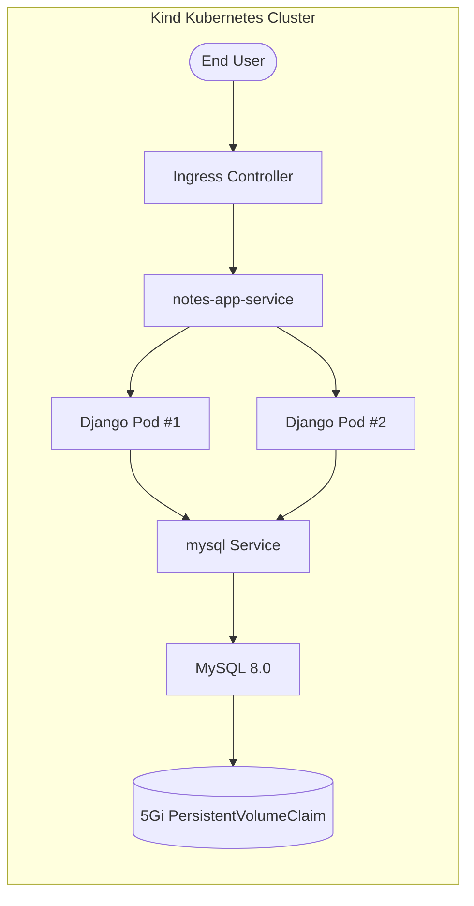
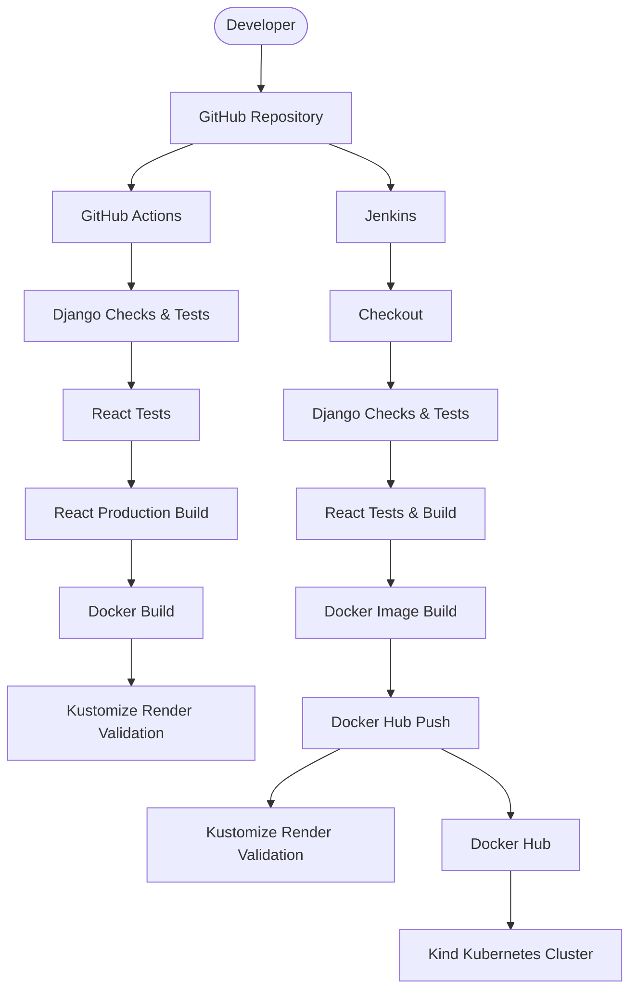

 🚀 Django + React Notes App — Kubernetes, CI/CD & DevSecOps


> **A production-oriented DevOps implementation of a Django + React application, covering containerization, CI/CD automation, Kubernetes orchestration, persistent storage, health-based traffic management, and container security.**

---

## 📌 Overview

This project takes a conventional Django + React Notes application and builds an infrastructure and delivery layer around it.

The objective was not simply to containerize the application, but to understand the complete path from:

**Source Code → Validation → Container Image → Registry → Kubernetes → Networking → Storage → Health Management**

The project combines:

- 🐳 Docker containerization
- 🔄 GitHub Actions CI
- 🔧 Jenkins Pipeline as Code
- 📦 Docker Hub image publishing
- ☸️ Kubernetes orchestration
- 🧩 Kustomize configuration management
- 🌐 Kubernetes Ingress and Services
- 💾 MySQL persistent storage
- 🩺 Liveness and readiness probes
- 🔐 Container security contexts
- 📊 Resource requests and limits
- ⚙️ Automated database migrations

The Kubernetes deployment is currently validated using a **local Kind cluster**, providing a realistic orchestration environment before moving toward managed/cloud Kubernetes.

---

# 🏗️ Architecture

## Application Runtime



### Request Flow

```text
External Request
       │
       ▼
Ingress Controller
       │
       ▼
notes-app-service
       │
       ├───────────────┐
       ▼               ▼
 Django Pod #1      Django Pod #2
       │               │
       └───────┬───────┘
               ▼
         mysql Service
               │
               ▼
           MySQL 8.0
               │
               ▼
       PersistentVolumeClaim
```

---

# 🔄 CI/CD Architecture

The repository uses **two complementary CI pathways**.



## GitHub Actions

The GitHub Actions workflow provides repository-native validation.

The workflow performs:

1. Repository checkout
2. Python environment setup
3. Node.js environment setup
4. Backend dependency installation
5. Django configuration checks
6. Django API tests
7. React dependency installation
8. React CI tests
9. React production build
10. Docker image build
11. Kubernetes/Kustomize rendering validation

This provides automated validation for application and infrastructure changes.

---

## Jenkins Pipeline

Jenkins provides a second CI/CD path focused on application validation and container image delivery.

```text
GitHub
   │
   ▼
Checkout
   │
   ▼
Django Checks
   │
   ▼
Django API Tests
   │
   ▼
React Tests
   │
   ▼
React Production Build
   │
   ▼
Docker Image Build
   │
   ▼
Docker Hub
   │
   ▼
Kustomize Render Validation
```

### Jenkins Stages

| Stage | Responsibility |
|---|---|
| Checkout | Retrieves the source repository |
| Backend Checks | Runs Django checks and API tests |
| Frontend Checks | Runs React tests and production build |
| Docker Build | Builds the application container image |
| Push Image | Publishes the image to Docker Hub on `main` |
| Kubernetes Validation | Validates the rendered Kustomize configuration |

The pipeline is defined as code through `Jenkinsfile`.

### Docker Image Tags

Jenkins publishes:

```text
sudarshan0907/notes-app-k8s:<BUILD_NUMBER>
sudarshan0907/notes-app-k8s:latest
```

The build-specific tag provides traceability while `latest` provides a convenient reference to the most recent image.

---

# 🐳 Containerization

The application uses a unified Python runtime image based on:

```text
python:3.12-slim
```

The image contains:

- Django application
- Django REST Framework
- React production build
- WhiteNoise static-file handling
- Gunicorn application server
- Required runtime dependencies

### Runtime Architecture

```text
                Docker Image
                     │
          ┌──────────┴──────────┐
          │                     │
     Django API            React Build
          │                     │
          └──────────┬──────────┘
                     │
                 WhiteNoise
                     │
                 Gunicorn
                     │
                  Port 8000
```

The container runs as a dedicated non-root user:

```text
UID: 10001
```

Gunicorn is used as the application server.

---

# 🎨 Frontend Integration

The React application is compiled into a production build and integrated into the Django application.

WhiteNoise serves the generated static assets directly from the Django runtime.

This allows the Kubernetes application layer to operate using a **single application runtime image** rather than maintaining a separate frontend runtime deployment.

This reduces the number of runtime components that need to be managed by Kubernetes.

---

# ☸️ Kubernetes Architecture

The Kubernetes deployment is managed using **Kustomize**.

## Kubernetes Resources

| Resource | Purpose |
|---|---|
| Namespace | Isolates application resources |
| Deployment | Manages Django application replicas |
| Service | Provides stable internal application networking |
| Ingress | Routes external HTTP traffic |
| ConfigMap | Stores non-sensitive configuration |
| Secret | Stores sensitive configuration |
| MySQL Deployment | Runs the database workload |
| MySQL Service | Provides internal database discovery |
| PersistentVolumeClaim | Provides persistent MySQL storage |
| Kustomization | Composes and renders Kubernetes resources |

---

# 📈 Application Availability

The Django application runs with:

```yaml
replicas: 2
```

This provides two application Pods behind the Kubernetes Service.

The Deployment uses a RollingUpdate strategy:

```yaml
strategy:
  type: RollingUpdate
  rollingUpdate:
    maxSurge: 1
    maxUnavailable: 0
```

This ensures that Kubernetes does not intentionally reduce the number of available application replicas during a normal rollout.

---

# 🩺 Health Checks & Readiness

A major reliability feature of this project is the distinction between **liveness** and **readiness**.

## Liveness

```text
GET /api/healthz/
```

Returns:

```json
{
  "status": "ok"
}
```

This endpoint allows Kubernetes to determine whether the Django application process is alive.

---

## Readiness

```text
GET /api/readyz/
```

The readiness endpoint performs an actual database connectivity check:

```sql
SELECT 1
```

If the database is unavailable, the application returns:

```text
HTTP 503
```

Otherwise:

```text
HTTP 200
```

This allows Kubernetes to distinguish between:

> **"The Django process is running."**

and:

> **"The Django instance is ready to serve traffic with its database dependency available."**

---

# 💾 Persistent MySQL Storage

The Django application is designed to be horizontally replicated while MySQL remains the stateful component.

```text
MySQL 8.0
    │
    ▼
mysql Service
    │
    ▼
MySQL Pod
    │
    ▼
5Gi PersistentVolumeClaim
```

The PVC uses:

```yaml
accessModes:
  - ReadWriteOnce
```

This separates database data from the lifecycle of an individual MySQL container.

> **Note:** A PVC provides persistent storage semantics, while actual durability depends on the underlying Kubernetes storage implementation.

---

# 🔐 Container & Kubernetes Security

The application container is hardened using Kubernetes security controls.

### Container Security Context

```yaml
runAsNonRoot: true
runAsUser: 10001
allowPrivilegeEscalation: false
```

The Pod also uses:

```text
fsGroup: 10001
```

This keeps filesystem permissions consistent between Docker and Kubernetes.

Sensitive configuration is injected through Kubernetes Secrets rather than being passed directly as command-line arguments.

---

# 📊 Resource Management

The application and MySQL workloads define CPU and memory requests and limits.

### Django

```text
Requests:
  CPU:    100m
  Memory: 128Mi

Limits:
  CPU:    500m
  Memory: 512Mi
```

### MySQL

```text
Requests:
  CPU:    100m
  Memory: 256Mi

Limits:
  CPU:    500m
  Memory: 512Mi
```

This provides Kubernetes with explicit resource requirements for scheduling and workload control.

---

# ⚙️ Database Initialization

Django migrations are executed through an **init container** before the application container starts serving traffic.

```text
Pod Startup
     │
     ▼
Migration Init Container
     │
     ▼
python manage.py migrate --noinput
     │
     ▼
Django Application Container
```

This integrates database schema initialization into the application startup lifecycle.

---

# 🗄️ Database Health Management

The MySQL workload uses Kubernetes health mechanisms for startup, readiness and liveness.

The probes use:

```text
mysqladmin ping
```

with authentication supplied through Kubernetes Secret configuration.

This allows Kubernetes to distinguish between:

- MySQL still starting
- MySQL ready to accept connections
- MySQL process becoming unhealthy

---

# 🧩 Configuration Management

Configuration is separated between ConfigMaps and Secrets.

### ConfigMap

Used for non-sensitive configuration such as:

```text
DJANGO_DEBUG
DJANGO_ALLOWED_HOSTS
DJANGO_DB_ENGINE
MYSQL_HOST
MYSQL_PORT
```

### Secret

Used for sensitive values such as:

```text
DJANGO_SECRET_KEY
MYSQL_DATABASE
MYSQL_USER
MYSQL_PASSWORD
MYSQL_ROOT_PASSWORD
```

> For a real production environment, secrets should be supplied through an external secret-management solution rather than committing real credentials to Git.

---

# 🧪 Testing Strategy

## Backend

The Django API contains automated tests covering:

- Health endpoint
- Readiness endpoint
- Note creation
- Note listing
- Note retrieval
- Note update
- Note deletion

Example:

```bash
DJANGO_USE_SQLITE=true python manage.py test api
```

The CI environment uses SQLite for application-level testing so the test suite does not require a live MySQL service.

---

## Frontend

The React application runs CI-compatible tests and a production build:

```bash
cd mynotes
npm ci
npm run test:ci
npm run build
```

---

# 🔧 Engineering Challenges & Solutions

This project involved several practical infrastructure and deployment challenges.

## 1. WhiteNoise / `collectstatic` Issue

The React production build contains generated assets and source maps.

An overly aggressive Docker build context can remove required static assets before Django's `collectstatic` process runs.

The `.dockerignore` was therefore carefully configured to preserve the required React build artifacts.

---

## 2. Non-Root Container Permissions

The application container creates:

```text
appuser → UID 10001
```

Kubernetes runs the container using the same UID.

The Pod also specifies:

```text
fsGroup: 10001
```

This keeps filesystem ownership consistent between Docker and Kubernetes.

---

## 3. Database-Aware Readiness

A process-level health check is not sufficient for an application that depends on MySQL.

The Django readiness endpoint performs:

```sql
SELECT 1
```

against the configured database.

If the check fails:

```text
HTTP 503 Service Unavailable
```

Kubernetes therefore does not consider the Pod ready to receive traffic.

---

## 4. MySQL Probe Authentication

The MySQL health probes use:

```text
mysqladmin ping
```

The required password is supplied through:

```text
MYSQL_PWD
```

using credentials sourced from the Kubernetes Secret configuration.

This allows the health checks to authenticate against the configured MySQL instance.

---

# 🐳 Docker Compose Development Environment

The repository also includes a Docker Compose environment for local development and application validation.

The local topology uses NGINX as the entry point:

```text
             NGINX
               │
               ▼
        Django / Gunicorn
               │
               ▼
             MySQL
               │
               ▼
          Docker Volume
```

Start the environment:

```bash
cp .env.example .env
docker compose up --build -d
```

Access the application through:

```text
http://localhost
```

Stop the environment:

```bash
docker compose down
```

To remove the local database volume:

```bash
docker compose down -v
```

---

# ☸️ Kubernetes Deployment

The Kubernetes manifests are designed for local Kubernetes environments such as **Kind or Minikube**.

## 1. Create a Kind Cluster

```bash
kind create cluster --name notes-app
```

Ensure an Ingress Controller is available in the cluster.

---

## 2. Configure Secrets

Review:

```text
k8s/mysql-secret.yml
```

Replace placeholder values with appropriate credentials.

For production environments, use an external secret-management solution.

---

## 3. Render the Manifests

Validate the complete Kustomize configuration:

```bash
kubectl kustomize k8s/
```

---

## 4. Deploy

```bash
kubectl apply -k k8s/
```

---

## 5. Verify

```bash
kubectl get pods -n notes-app
kubectl get services -n notes-app
kubectl get deployments -n notes-app
kubectl get ingress -n notes-app
```

---

# 🔍 Useful Kubernetes Debugging Commands

### View all resources

```bash
kubectl get all -n notes-app
```

### Application logs

```bash
kubectl logs -n notes-app deployment/notes-app-deployment
```

### MySQL logs

```bash
kubectl logs -n notes-app deployment/mysql
```

### Inspect a Pod

```bash
kubectl describe pod <pod-name> -n notes-app
```

### Check rollout status

```bash
kubectl rollout status deployment/notes-app-deployment -n notes-app
```

### Inspect Kustomize output

```bash
kubectl kustomize k8s/
```

---

# 📂 Repository Structure

```text
django-notes-app-k8s/
│
├── .github/
│   └── workflows/
│       └── ci.yml
│
├── api/
│   ├── migrations/
│   ├── models.py
│   ├── serializers.py
│   ├── tests.py
│   ├── urls.py
│   └── views.py
│
├── notesapp/
│   ├── settings.py
│   ├── urls.py
│   ├── asgi.py
│   └── wsgi.py
│
├── mynotes/
│   ├── src/
│   ├── public/
│   ├── build/
│   ├── package.json
│   └── package-lock.json
│
├── k8s/
│   ├── namespace.yml
│   ├── configmap.yml
│   ├── mysql-secret.yml
│   ├── mysql-pvc.yml
│   ├── mysql-service.yml
│   ├── mysql-deployment.yml
│   ├── service.yml
│   ├── deployment.yml
│   ├── ingress.yml
│   └── kustomization.yml
│
├── nginx/
│   └── default.conf
│
├── Dockerfile
├── docker-compose.yml
├── Jenkinsfile
├── jenkins-Dockerfile
├── jenkins-docker-compose.yml
├── Makefile
├── requirements.txt
├── manage.py
└── README.md
```

---

# 🛠️ Developer Commands

The repository includes a Makefile for common development and validation tasks.

```bash
make check
make backend-test
make frontend-test
make build
make test
make docker-build
make compose-config
make k8s-render
```

Run the complete local validation suite:

```bash
make test
```

Validate Kubernetes configuration without applying it:

```bash
make k8s-render
```

---

# 📊 Deployment Validation

The Kubernetes runtime can be inspected using:

```bash
kubectl get all -n notes-app
```

A healthy application deployment should show two Django replicas and a running MySQL workload:

```text
mysql                         1/1   Running
notes-app-deployment-xxxxx   1/1   Running
notes-app-deployment-xxxxx   1/1   Running
```

The Django application becomes ready only after its readiness check can successfully communicate with the database.

---

# 🧠 Key Engineering Decisions

### Unified Runtime Image

The React application is compiled during the build process and served through Django using WhiteNoise, avoiding a separate frontend runtime deployment.

### Stateless Application Layer

Django runs with multiple replicas while persistent application state is delegated to MySQL.

### Database-Aware Readiness

The `/api/readyz/` endpoint verifies database connectivity before a Pod is considered ready.

### Declarative Kubernetes Configuration

Kustomize is used to compose and render the Kubernetes resource set.

### Container Hardening

Application containers run as a dedicated non-root UID with privilege escalation disabled.

### Persistent Database Storage

MySQL uses a PersistentVolumeClaim so database data is not tied exclusively to the lifecycle of an individual container.

---

# 🔭 Current Scope

The current implementation is a **production-oriented local Kubernetes deployment validated with Kind**.

It demonstrates application delivery and runtime patterns that can serve as a foundation for a larger cloud deployment.

The current implementation does **not** claim to provide:

- Managed Kubernetes
- Multi-node production infrastructure
- Highly available MySQL
- Centralized logging
- Prometheus/Grafana monitoring
- External secret management
- Cloud load balancing
- Automated cloud infrastructure provisioning

These represent natural next steps for extending the platform.

---

# 🚧 Future Improvements

## Infrastructure

- Terraform-based infrastructure provisioning
- Managed Kubernetes deployment
- Cloud load balancer integration
- Separate development, staging and production environments

## Observability

- Prometheus metrics
- Grafana dashboards
- Centralized application logging
- Kubernetes event monitoring
- Alerting

## Security

- Container image vulnerability scanning
- SBOM generation
- External Secret Management
- NetworkPolicies
- Pod Security Standards
- Dependency vulnerability scanning

## Delivery

- GitOps deployment with Argo CD
- Automated image promotion
- Environment-specific Kustomize overlays
- Deployment approval gates
- Automated rollback workflows

## Database

- Managed MySQL
- Automated database backups
- Point-in-time recovery
- High-availability database architecture

---

# 🧱 Technology Stack

### Application

- Python
- Django
- Django REST Framework
- React
- MySQL

### Containerization

- Docker
- Docker Compose
- Gunicorn
- WhiteNoise

### CI/CD

- Jenkins
- GitHub Actions
- Docker Hub

### Kubernetes

- Kubernetes
- Kind
- Kustomize
- Ingress
- ConfigMaps
- Secrets
- Deployments
- Services
- PersistentVolumeClaims
- Init Containers
- Health Probes

### Infrastructure & Operations

- Linux
- Bash
- NGINX
- kubectl

---

# 🎯 What This Project Demonstrates

### Containerization

- Docker image creation
- Runtime optimization
- Unified application image
- Non-root containers
- Gunicorn-based application serving

### CI/CD

- Jenkins Pipeline as Code
- GitHub Actions
- Automated application testing
- Container image publishing
- Kubernetes configuration validation

### Kubernetes

- Deployments
- Services
- Ingress
- ConfigMaps
- Secrets
- Kustomize
- Persistent storage
- Init containers
- Rolling updates
- Resource management
- Health probes

### Reliability

- Multiple application replicas
- Database-aware readiness
- Liveness detection
- Startup probes
- Persistent state
- Controlled rollouts

### Security

- Non-root execution
- Restricted privilege escalation
- Secret-based configuration
- Explicit resource controls

---

# 💡 Engineering Takeaway

The most valuable part of this project was not learning individual commands.

It was understanding how the infrastructure layers interact:

```text
Application
     │
     ▼
Docker
     │
     ▼
CI/CD
     │
     ▼
Container Registry
     │
     ▼
Kubernetes
     │
 ┌───┴─────────────┐
 ▼                 ▼
Networking       Storage
 │                 │
 ▼                 ▼
Ingress           MySQL
 │
 ▼
Health & Reliability
```

A reliable deployment is not simply an application running inside a container.

It is the combination of:

**repeatable builds + automated validation + secure containers + declarative infrastructure + reliable networking + persistent storage + health-aware orchestration.**

---

# 👨‍💻 Author

**Sudarshan Vashisht**

Focused on building practical expertise in:

**Linux • Docker • Kubernetes • CI/CD • Platform Engineering • Cloud Infrastructure • Automation**

---

## 🔗 Project

**GitHub:**  
https://github.com/sudarshanvashisht/django-notes-app-k8s

---

⭐ If you find the project useful, feel free to explore the repository and the engineering decisions behind the deployment.
