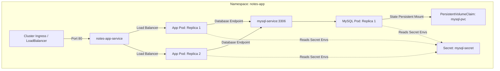
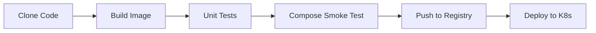

# 🚀 django-notes-app-k8s: Production-Grade DevOps & GitOps Lifecycle

> A full-stack Notes Application (Django REST API + React) transformed from a standard local development setup into a hardened, self-healing, and fully automated cloud-native application orchestrated on Kubernetes (Kind) and deployed via a 6-stage Jenkins declarative GitOps pipeline.

---

## 📐 System & Deployment Architecture

This project demonstrates a decoupled 3-tier architecture designed for high availability, security isolation, and independent resource scaling.

### 1. Local Development Stack (Docker Compose)
In development, Nginx acts as a reverse proxy, serving the React frontend static build directly and routing API requests (`/api/*`) to Gunicorn/Django, backed by a local MySQL database.


### 2. Kubernetes Orchestration Architecture (Production Target)
In production, traffic enters via an Nginx Ingress Controller (Layer 7 Load Balancer), which routes requests to a multi-replica Gunicorn/Django deployment. Workloads are isolated within a dedicated namespace, with database credentials secured via Kubernetes Secrets and state persisted via Persistent Volume Claims.



---

## 🛠️ Infrastructure & Tech Stack
*   **Application Core:** Django REST Framework (Backend API) & React (Frontend SPA).
*   **Server Engine:** Gunicorn WSGI HTTP Server.
*   **Web Server & Reverse Proxy:** Nginx (Alpine-based, serves frontend builds and proxies API requests).
*   **Local Multi-Container Runtime:** Docker Compose.
*   **Container Orchestration:** Kubernetes (Kind Local Cluster).
*   **Continuous Integration Engine:** Jenkins (Declarative pipeline running in Docker).
*   **Container Registry:** Docker Hub (`sudarshan0907/notes-app-k8s`).

---

## 📈 DevOpsifying the Stack: Before vs. After

The primary goal of this project was to transition a standard local development stack into a production-hardened DevOps lifecycle:

| Feature / Metric | Local Development Stack (Before) | Production DevOps Stack (After) |
|---|---|---|
| **Container User** | `root` (Security risk) | **`appuser` (UID 10001)** (Non-root privilege isolation) |
| **Workload Orchestration** | Docker Compose (Single node, no scaling) | **Kubernetes (Kind)** (Multi-replica, high availability) |
| **Traffic Gateway** | Port exposed directly on host | **Kubernetes Ingress (Port 80)** (Layer 7 path-based routing) |
| **Image Tagging Strategy** | Static `:latest` tag | **Dynamic Git Commit SHA** (Full build-to-source traceability) |
| **Database Scaling Strategy** | Rolling Updates (Causes Volume Deadlocks) | **`Recreate` Strategy** (Releases PVC lock before starting database) |
| **Self-Healing Capabilities** | None (Manually restart on crash) | **Liveness & Readiness Probes** (Automated restart and traffic routing) |
| **CI/CD Lifecycle** | Manual script execution | **Declarative Jenkins Pipeline** (6 automated GitOps stages) |
| **Test Database Dependency** | Requires active MySQL database | **In-memory SQLite Fallback** (Isolated unit tests run in <5s) |

---

## 🤖 Jenkins CI/CD Pipeline (GitOps Lifecycle)

The Jenkins pipeline automates the software development lifecycle from code commit to target environment deployment.



### Pipeline Stage Details

1.  **Clone Code:** Pulls latest code from the source repository's main branch. Retrieves Git Commit SHA as the build identifier.
2.  **Build Docker Image:** Builds the Gunicorn/Django image locally using Docker build layer caching.
3.  **Run Unit Tests:** Executes Django API tests inside a transient container using an SQLite in-memory database to eliminate external DB dependencies.
4.  **Test & Run via Compose:** Starts Gunicorn + MySQL container stack using Docker Compose, performs health check, and checks container logs before tearing down the stack.
5.  **Push to Docker Hub:** Authenticates using your Jenkins credentials (`dockerHub`), tags, and pushes the built image with both the unique Git SHA tag (`:911545a`) and the `:latest` tag to Docker Hub.
6.  **Deploy to Kubernetes:** Loads the image into Kind nodes, injects the Git tag into deployment manifests via `sed`, applies resource manifests, and monitors the rollout status.

---

## ☸️ Kubernetes Infrastructure Layout (`/k8s`)

The declarative manifests in `/k8s` define a self-healing, decoupled state in the cluster:

| Manifest | Kubernetes Resource | Description | Configuration Details |
|---|---|---|---|
| `namespace.yml` | `Namespace` | Logical segregation of assets. | Namespace: `notes-app` |
| `mysql-secret.yml` | `Secret` | Sensitive configuration data. | Opaque secret containing 4 DB credentials. |
| `mysql-pvc.yml` | `PersistentVolumeClaim` | Permanent database block storage request. | Size: `5Gi`, AccessMode: `ReadWriteOnce`. |
| `mysql-deployment.yml` | `Deployment` | Stateful single-replica MySQL 8.0 database. | Mounted to PVC, uses `Recreate` strategy, executes `mysqladmin ping` probes. |
| `mysql-service.yml` | `Service` | Exposes MySQL cluster-internally. | Type: `ClusterIP`, Port: `3306`. |
| `deployment.yml` | `Deployment` | Django application lifecycle controller. | 2 Replicas, defines CPU/Memory requests & limits, configures HTTP probes, allows wildcard host headers. |
| `service.yml` | `Service` | Exposes Django application internally. | Type: `ClusterIP`, Port: `8000`. |
| `ingress.yml` | `Ingress` | Decoupled entry gateway for routing external HTTP requests. | Routes `/` traffic on port 80 to `notes-app-service`. |

---

## 🧠 What We Learned (SRE & DevOps Key Takeaways)

### 1. MySQL PV Rolling Update Deadlock
**The Challenge:** Single-replica database deployments mounting Persistent Volumes with `ReadWriteOnce` access mode would deadlock during standard rolling updates (`RollingUpdate`) because the new replica pod tried to lock the data files while the old pod was still running.
**The Solution:** Configured the MySQL rollout strategy to `Recreate` so that Kubernetes terminates the old pod first, releasing the volume locks before spinning up the new version.

### 2. Django Host Header Validation in K8s
**The Challenge:** Django's `ALLOWED_HOSTS` configuration rejected internal Kubernetes liveness/readiness probes (which check using the Pod's internal IP address, resulting in HTTP 400 errors) unless wildcard allowed hosts were specified for the container environment.
**The Solution:** Injected the environment variable `DJANGO_ALLOWED_HOSTS: "*"` specifically inside the pod's container specification template.

### 3. Database Test Isolation
**The Challenge:** Running unit tests against a live MySQL database during the CI stage introduces network latency and risks polluting production schemas.
**The Solution:** Added a test execution detection inside `notesapp/settings.py` to fall back to an in-memory SQLite database (`:memory:`) when unit tests run:
```python
import sys
if 'test' in sys.argv:
    DATABASES = {
        'default': {
            'ENGINE': 'django.db.backends.sqlite3',
            'NAME': ':memory:',
        }
    }
```

### 4. Dynamic Tagging Traceability
**The Challenge:** Hardcoding static image tags like `:latest` prevents Kubernetes from updating pods during new commits and makes tracking active builds impossible.
**The Solution:** Integrated Git-commit-SHA parameterized builds (`git rev-parse --short HEAD`) into the Jenkins pipeline, allowing full build traceability from Pod ➔ Registry Image ➔ exact source code commit.

---

## 🛠️ Operational Tasks (How to Run)

### 1. Local Development (Docker Compose)
To spin up Gunicorn, MySQL, and Nginx locally:
```bash
# Clone the repository
git clone https://github.com/sudarshanvashisht/django-notes-app-k8s.git
cd django-notes-app-k8s

# Create environment template
cp .env.example .env

# Run compose
docker compose up --build -d
```
Access the application on your host machine at `http://localhost`.

### 2. Run Local Unit Tests
To validate code quality before pushing commits:
```bash
# Build test image
docker build . -t notes-app-test:local

# Run tests
docker run --rm notes-app-test:local python manage.py test
```

### 3. Deploy Manually to Kubernetes Cluster
If you want to bypass Jenkins and apply configurations directly:
```bash
# Apply resources
kubectl apply -f k8s/namespace.yml
kubectl apply -f k8s/mysql-secret.yml
kubectl apply -f k8s/

# Monitor deployment progress
kubectl get pods -n notes-app -w
```